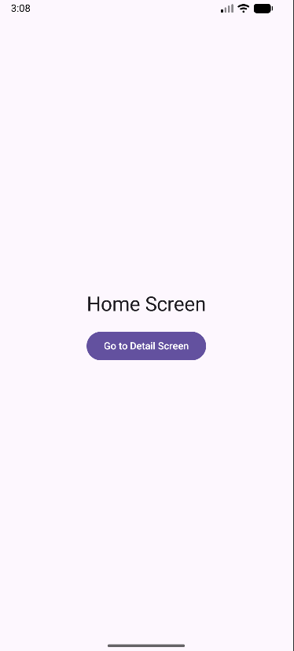

# Latihan Modul 5 - Navigasi Dasar

Proyek ini adalah implementasi dari **Latihan 1: Navigasi Dasar** menggunakan Jetpack Compose Multiplatform.

## Deskripsi Latihan
Membuat alur navigasi sederhana antar layar:
1. **Home Screen**: Layar utama yang berisi tombol untuk menuju ke layar Detail.
2. **Detail Screen**: Layar tujuan yang berisi tombol untuk kembali ke layar sebelumnya.
3. **Back Navigation**: Menggunakan `popBackStack()` dan mendukung tombol back sistem.

## Checklist Implementasi
- [x] Setup `NavController` menggunakan `rememberNavController()`
- [x] Setup `NavHost` dengan `startDestination` ke "home"
- [x] Membuat `HomeScreen` dengan tombol navigasi
- [x] Implementasi `navController.navigate("detail")`
- [x] Membuat `DetailScreen` dengan tombol back
- [x] Implementasi `navController.popBackStack()`
- [x] Verifikasi tombol back sistem

## Dokumentasi Hasil Latihan

### 1. Home Screen
> 

### 2. Detail Screen
> 

---

## Cara Menjalankan Project
### Android
```shell
./gradlew :composeApp:assembleDebug
```

### Desktop
```shell
./gradlew :composeApp:run
```
