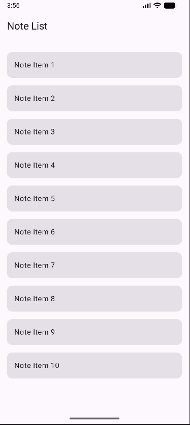

# Laporan Latihan 2: Navigasi dengan Argument

Proyek ini merupakan implementasi navigasi antar layar (Note List ke Note Detail) dengan pengiriman argumen `noteId` menggunakan Jetpack Compose Navigation pada Kotlin Multiplatform.

## Penjelasan Implementasi
Pada latihan ini, navigasi dikelola menggunakan `NavHost` dengan beberapa komponen utama:
1.  **Sealed Class Screen**: Digunakan untuk mendefinisikan rute secara terstruktur. Rute detail menggunakan parameter `{noteId}`.
2.  **NavHost & NavGraph**: Mengatur perpindahan antar composable. Argumen `noteId` didefinisikan dengan tipe `NavType.IntType`.
3.  **Passing Data**: Saat item di daftar diklik, fungsi `navController.navigate` dipanggil dengan rute dinamis yang menyertakan ID catatan.
4.  **Retrieving Data**: Di layar detail, `backStackEntry` digunakan untuk mengambil nilai `noteId` yang dikirim.
5.  **Manual Back Navigation**: Implementasi tombol kembali pada `TopAppBar` menggunakan `navController.popBackStack()`.

## Fitur Aplikasi
- Daftar catatan dinamis (10 item).
- Navigasi ke detail spesifik berdasarkan item yang diklik.
- Tampilan Detail yang menunjukkan ID dari catatan yang dipilih.
- Fungsi kembali ke halaman utama yang responsif.

## Dokumentasi Hasil Running

|  Halaman Daftar (Note List)   |      Halaman Detail (Note Detail)      |
|:-----------------------------:|:--------------------------------------:|
|  |  |

---
**Dibuat untuk:** Tugas Pemrograman Aplikasi Mobile (PAM) - Modul 5 Latihan 2
