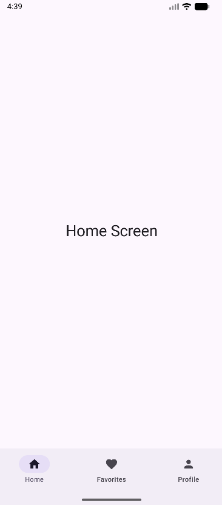
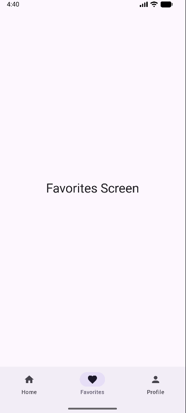
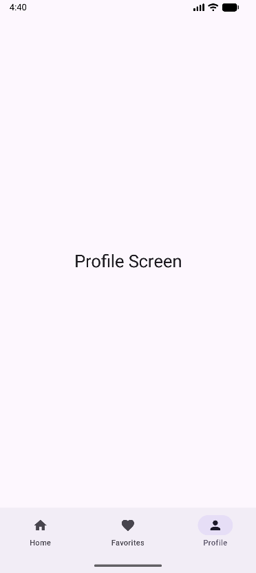

# Modul 5 Latihan 3: Bottom Navigation

Proyek ini adalah implementasi dari Latihan 3 tentang **Bottom Navigation** menggunakan Compose Multiplatform dan Jetpack Navigation.

## Deskripsi Latihan
Latihan ini fokus pada implementasi navigasi antar halaman menggunakan bilah navigasi di bagian bawah layar (Bottom Navigation Bar) dengan 3 tab utama.

### Checklist Implementasi:
- [x] **BottomNavItem (Sealed Class)**: Mendefinisikan rute, ikon, dan label untuk setiap item menu.
- [x] **NavigationBar Component**: Implementasi container utama untuk menu navigasi bawah.
- [x] **NavigationBarItem**: Representasi setiap tab (Home, Favorites, Profile).
- [x] **Selected State**: Menggunakan `currentBackStackEntryAsState` untuk menandai tab mana yang sedang aktif.
- [x] **Scaffold**: Menggunakan komponen Scaffold untuk menempatkan `bottomBar` dan konten utama secara otomatis.
- [x] **NavHost**: Mengelola perpindahan antar layar berdasarkan rute yang dipilih.
- [x] **3 Screen Composables**: Menyediakan tampilan berbeda untuk setiap tab (`HomeScreen`, `FavoritesScreen`, `ProfileScreen`).

## Screenshots
Berikut adalah tampilan hasil implementasi Bottom Navigation:

|    Home Screen    |      Favorites Screen       |     Profile Screen      |
|:-----------------:|:---------------------------:|:-----------------------:|
|  |  |  |

> **Catatan**: Ganti link gambar di atas dengan screenshot asli dari perangkat/emulator Anda.

---

## Struktur Navigasi
1. **Home**: Rute `"home"`, menggunakan `Icons.Default.Home`.
2. **Favorites**: Rute `"favorites"`, menggunakan `Icons.Default.Favorite`.
3. **Profile**: Rute `"profile"`, menggunakan `Icons.Default.Person`.

---

## Dokumentasi Teknis

### Cara Kerja Navigasi
Navigasi dikelola oleh `NavController`. Saat pengguna menekan item di `NavigationBar`, fungsi `navController.navigate(route)` dipanggil.
Untuk menjaga performa dan state aplikasi, digunakan parameter tambahan:
- `popUpTo(startDestination)`: Membersihkan tumpukan backstack agar tidak terjadi penumpukan saat berpindah antar tab utama.
- `launchSingleTop = true`: Menghindari pembuatan instance ganda dari destinasi yang sama.
- `restoreState = true`: Mengembalikan state halaman sebelumnya saat tab diklik kembali.

### File Utama
- `composeApp/src/commonMain/kotlin/com/example/modul5latihan3/App.kt`: Berisi logika navigasi utama dan komponen UI.

---

## Cara Menjalankan Proyek

### Android
```shell
./gradlew :composeApp:assembleDebug
```

### Desktop (JVM)
```shell
./gradlew :composeApp:run
```

### iOS
Buka direktori `iosApp` di Xcode atau gunakan run configuration di Android Studio.

### Web (Wasm)
```shell
./gradlew :composeApp:wasmJsBrowserDevelopmentRun
```
