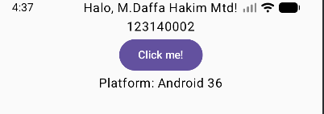

# Tugas 1: Setup & Modifikasi Kotlin Multiplatform (KMP)

Repository ini berisi hasil pengerjaan tugas praktikum Pemrograman Mobile untuk materi pengenalan Kotlin Multiplatform (Compose Multiplatform).

##  Identitas Mahasiswa
* **Nama:** [M.Daffa Hakim Matondang]
* **NIM:** [123140002]
* **Kelas:** [PAM RA]

## Screenshot Hasil Run
Berikut adalah tampilan aplikasi yang dijalankan di platform **Android / Desktop**:

##  Modifikasi yang Dilakukan
Sesuai instruksi tugas, berikut adalah perubahan yang dilakukan pada template *Hello World*:
1.  **Ubah Teks Sapaan:** Mengubah "Hello World" menjadi "Halo, [Nama Saya]!".
2.  **Tambah Identitas:** Menambahkan Text komponen baru untuk menampilkan NIM.
3.  **Tampilkan Platform:** Menggunakan fungsi `getPlatform().name` untuk menampilkan sistem operasi yang sedang berjalan (Android/Desktop/iOS) tanpa perlu diklik (langsung muncul).

##  Cara Menjalankan Project
1.  Clone repository ini.
2.  Buka di Android Studio (pastikan plugin KMP sudah aktif).
3.  Sync Gradle.
4.  Pilih konfigurasi run (composeApp) dan jalankan di Emulator Android atau Desktop.