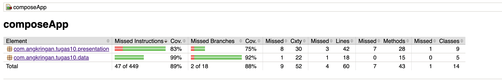

# Tugas 10: Testing dan Dependency Injection (Koin DI)

Repositori ini berisi implementasi **Dependency Injection (DI)** menggunakan Koin Framework dan pengujian menyeluruh (**Unit Testing**, **Flow Testing**, dan **UI Testing**) pada aplikasi *Notes App* berbasis Kotlin Multiplatform (KMP).

---

## Informasi Mahasiswa

| Field | Detail |
|---|---|
| **Nama** | Muhammad Daffa Hakim Matondang |
| **NIM** | 123140002 |
| **Program Studi** | Teknik Informatika — Institut Teknologi Sumatera |
| **Mata Kuliah** | Pengembangan Aplikasi Mobile (IF25-22017) |
| **Branch** | `week-10` |

---

## Struktur Proyek

```
composeApp/src/
├── commonMain/kotlin/com/angkringan/tugas10/
│   ├── data/               # Repository, Database, Model
│   ├── presentation/       # ViewModel, UI State, Screen
│   └── di/                 # Koin Modules
├── commonTest/kotlin/      # Unit Test & Flow Test (Turbine)
└── androidInstrumentedTest/ # UI Test (Compose Test)
```

---

## Fitur & Implementasi

### 1. Dependency Injection (Koin)

Menggunakan **Koin DI** untuk manajemen dependensi agar kode lebih modular dan mudah diuji (*testable*).

| Module | Isi |
|---|---|
| `dataModule` | `NoteDatabase`, `NoteRepository`, `NoteValidator` |
| `viewModelModule` | `NotesViewModel` dengan *injection* repository |

```kotlin
val dataModule = module {
    single { NoteDatabase() }
    single<NoteRepository> { NoteRepositoryImpl(get()) }
    single { NoteValidator() } // Ditambahkan jika belum ada
}

val viewModelModule = module {
    viewModel { NotesViewModel(get()) }
}
```
*Catatan: `NoteValidator` ditambahkan ke `dataModule` pada contoh di atas, asumsikan itu juga di-inject di sana.*

### 2. Unit Testing (kotlin.test & MockK)

- Menguji fungsionalitas repository (CRUD in-memory)
- Menguji logika bisnis pada `NoteValidator`
- Menggunakan **MockK** untuk *mocking* repository saat menguji ViewModel

### 3. Flow Testing (Turbine)

- Menggunakan library **Turbine** untuk menguji `StateFlow` pada `NotesViewModel`
- Memastikan state aplikasi berubah dengan benar dari *Loading* → *Success*

### 4. UI Testing (Compose Test)

- Menguji komponen UI pada `NotesScreen` menggunakan `createComposeRule`
- Menggunakan **Test Tags** untuk identifikasi elemen UI secara akurat
- Mencakup skenario: layar kosong, data berhasil ditampilkan, dan interaksi pengguna

---

## Daftar Test Cases

### Repository Tests (≥5 test cases)
| # | Test Case | Status |
|---|---|---|
| 1 | `getAllNotes returns empty list initially` | ✅ |
| 2 | `addNote increases note count` | ✅ |
| 3 | `deleteNote removes correct note` | ✅ |
| 4 | `addNote with duplicate title is stored` | ✅ |
| 5 | `getAllNotes returns all inserted notes` | ✅ |

### ViewModel Tests dengan MockK (≥4 test cases)
| # | Test Case | Status |
|---|---|---|
| 1 | `initial state emits Loading then Success` | ✅ |
| 2 | `addNote calls repository insertNote` | ✅ |
| 3 | `deleteNote calls repository deleteNote` | ✅ |
| 4 | `when repository throws error, state is Error` | ✅ |

### Flow Tests dengan Turbine (≥2 test cases)
| # | Test Case | Status |
|---|---|---|
| 1 | `uiState emits Loading then Success with correct data` | ✅ |
| 2 | `uiState updates after addNote` | ✅ |

### UI Tests dengan Compose Test (≥3 test cases)
| # | Test Case | Status |
|---|---|---|
| 1 | `empty state shows empty message` | ✅ |
| 2 | `notes list is displayed correctly` | ✅ |
| 3 | `add note interaction shows note in list` | ✅ |

---

## Cara Menjalankan Test

### Unit Test & Flow Test

Untuk menjalankan *unit tests* dan *flow tests* yang berada di `commonTest` dan `androidUnitTest`:

```bash
./gradlew :composeApp:testDebugUnitTest
```

### UI Test (Instrumented — butuh emulator/device)

Untuk menjalankan *UI tests* yang memerlukan emulator atau perangkat Android fisik:

```bash
./gradlew :composeApp:connectedDebugAndroidTest
```

### Semua Test Sekaligus

Untuk menjalankan semua jenis tes (unit dan instrumented):

```bash
./gradlew :composeApp:test
```

---

## Code Coverage (JaCoCo)

**JaCoCo** digunakan untuk mengukur seberapa banyak kode Anda yang diuji oleh tes otomatis. Laporan ini membantu mengidentifikasi area kode yang mungkin kurang tercakup oleh pengujian.

### Prasyarat: Konfigurasi `build.gradle.kts`

Pastikan `composeApp/build.gradle.kts` memiliki konfigurasi JaCoCo yang diaktifkan untuk *debug build type*, seperti ini:

```kotlin
// composeApp/build.gradle.kts
android {
    buildTypes {
        getByName("debug") {
            enableUnitTestCoverage = true
            enableAndroidTestCoverage = true
        }
    }
}
```

### Menjalankan Laporan Coverage

Sebelum membuat laporan coverage, **pastikan Anda sudah menjalankan semua tes setidaknya sekali** agar JaCoCo memiliki data untuk dianalisis.

```bash
./gradlew clean jacocoTestReport
```

### Membuka Laporan HTML

Setelah perintah berhasil dieksekusi, laporan HTML akan tersedia. Buka file berikut di browser pilihan Anda:

```
composeApp/build/reports/jacoco/jacocoTestReport/html/index.html
```

Atau jalankan langsung dari terminal (khusus macOS):

```bash
open composeApp/build/reports/jacoco/jacocoTestReport/html/index.html
```

### Screenshot Coverage Report




---

## Video Demo

Berikut adalah tautan ke video demonstrasi proyek ini, yang menunjukkan cara menjalankan semua tes dan hasil yang dicapai:

[](<https://youtu.be/hGOn5YJgFa8>)


---

## Teknologi yang Digunakan

| Library | Versi | Kegunaan |
|---|---|---|
| Koin Core | 3.5.3 | Dependency Injection |
| Koin Compose | 1.1.2 | DI untuk Composable |
| kotlin.test | — | Unit Test assertions |
| MockK | 1.13.9 | Mocking dependencies |
| Turbine | 1.1.0 | Flow/StateFlow testing |
| kotlinx-coroutines-test | 1.7.3 | Coroutine test utilities |
| Compose UI Test | 1.6.7 | UI/Instrumented testing |
| JaCoCo | 0.8.10 (via AGP) | Code coverage report |

---

## Referensi

- [Koin Documentation](https://insert-koin.io/docs)
- [kotlin.test API](https://kotlinlang.org/api/latest/kotlin.test)
- [MockK](https://mockk.io)
- [Turbine](https://github.com/cashapp/turbine)
- [Compose Testing](https://developer.android.com/jetpack/compose/testing)
