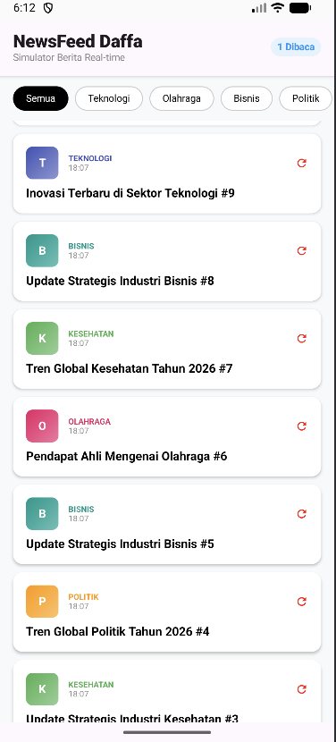

# News Feed Daffa - Simulator Berita Real-time

Aplikasi News Feed Daffa adalah simulator umpan berita (news feed) modern yang dibangun menggunakan Kotlin Multiplatform (KMP) dan Jetpack Compose. Aplikasi ini mendemonstrasikan pengolahan data reaktif secara real-time menggunakan teknologi terbaru dalam ekosistem Android.

## Pratinjau Aplikasi

## Fitur Utama
* Real-time News Stream: Simulasi pengiriman berita baru secara otomatis setiap 2,5 detik menggunakan Kotlin Flow.
* Dynamic Filtering: Sistem filtrasi kategori (Teknologi, Olahraga, Bisnis, dll) yang responsif.
* Async Content Loading: Simulasi pengambilan detail berita dari server secara asinkron menggunakan Coroutines dengan indikator pemuatan (loading state).
* Interactive UI: Antarmuka modern dengan kartu berita yang dapat dikembangkan (expandable card) dan animasi halus.
* State Management: Melacak jumlah berita yang telah dibaca secara akurat menggunakan StateFlow.

## Teknologi yang Digunakan
* Kotlin Multiplatform (KMP): Struktur proyek lintas platform.
* Jetpack Compose: Untuk membangun UI deklaratif yang modern.
* Kotlin Coroutines & Flow: Menangani aliran data asinkron dan manajemen konkurensi.
* MVVM Architecture: Pemisahan logika bisnis (ViewModel) dan tampilan (UI) yang bersih.
* Material Design 3: Standar desain terbaru dari Google untuk komponen UI.

## Cara Menjalankan Program

### Prasyarat
* Android Studio (Versi Ladybug atau yang terbaru disarankan).
* JDK 11 atau lebih tinggi.
* Koneksi internet untuk sinkronisasi Gradle pertama kali.

### Langkah-langkah
1. Clone Repositori:
   git clone : https://github.com/Dakim777/PAM-NEWSFEED.git
2. Buka Proyek:
   Buka Android Studio, lalu pilih Open dan arahkan ke folder hasil clone tadi.
3. Sync Gradle:
   Tunggu Android Studio menyelesaikan proses sinkronisasi Gradle. Jika muncul bar notifikasi bertuliskan "Sync Now", klik tombol tersebut.
4. Pilih Target Run:
   Pada toolbar atas Android Studio, pastikan konfigurasi jalannya adalah composeApp dan pilih emulator atau perangkat Android fisik Anda.
5. Jalankan:
   Klik tombol Run (ikon Play hijau) atau tekan Shift + F10.

## Struktur Proyek
* composeApp/src/androidMain: Berisi kode spesifik platform Android dan MainActivity.
* composeApp/src/commonMain: Tempat logika UI dan komponen Compose yang dibagikan.
* NewsFeedSimulator.kt: File utama yang berisi logika ViewModel, Repository, dan UI Screen.

---
Dikembangkan oleh Daffa sebagai bagian dari pembelajaran pengembangan aplikasi Mobile.