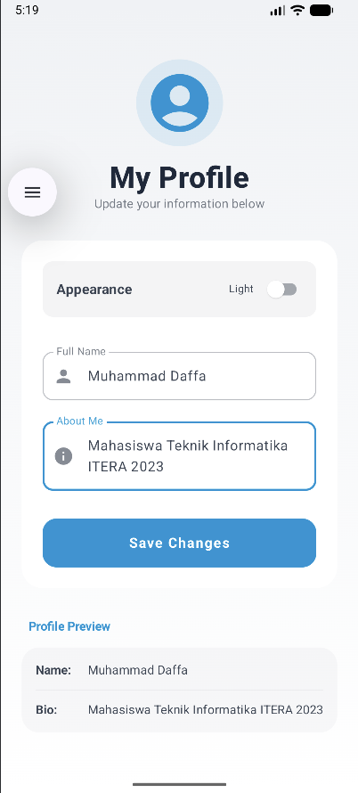
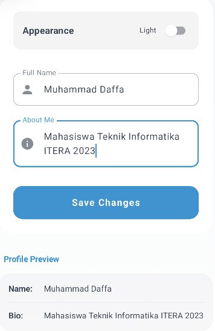
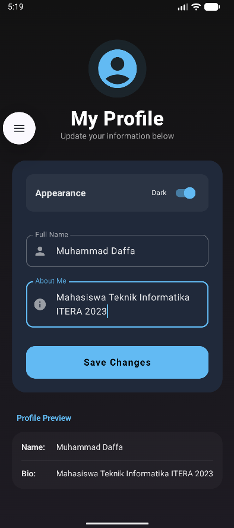

# Profile App - Kotlin Multiplatform (Tugas 4)

Aplikasi Profil sederhana yang dikembangkan menggunakan **Kotlin Multiplatform (KMP)** dan **Compose Multiplatform**. Proyek ini mendemonstrasikan implementasi pola desain MVVM, State Management dengan StateFlow, serta fitur UI modern seperti Dark Mode.

## Fitur Utama
- **MVVM Architecture**: Pemisahan logika bisnis (ViewModel) dan UI yang bersih.
- **Profile Management**: Form untuk memperbarui Nama dan Bio secara real-time.
- **Dynamic Dark Mode**: Peralihan tema gelap/terang yang tersinkronisasi dengan sistem status bar Android.
- **Modern UI/UX**: 
  - Layout presisi di tengah layar.
  - Penggunaan *Safe Area* (`systemBarsPadding`) agar tidak menabrak taskbar/status bar.
  - Palet warna biru khas Kotlin (Kotlin Style Blue).
  - Komponen Card dan Rounded Corners yang estetis.

## Struktur Proyek (Sub-folder: `composeApp`)
Sesuai dengan spesifikasi tugas, kode diatur ke dalam folder berikut:
- `data/`: Berisi `ProfileUiState.kt` (Model data untuk state aplikasi).
- `viewmodel/`: Berisi `ProfileViewModel.kt` (Logika bisnis menggunakan StateFlow).
- `ui/`: Berisi `ProfileScreen.kt` (Layout utama) dan `Components.kt` (Komponen UI yang dapat digunakan kembali).

## Teknologi yang Digunakan
- **Kotlin Multiplatform (KMP)**
- **Compose Multiplatform** (Android, iOS, Desktop, Web)
- **Jetpack Lifecycle ViewModel** (Compose Multiplatform Version)
- **Material Design**

---

## Cara Menjalankan

### Android
Gunakan Android Studio dan jalankan konfigurasi `:composeApp` pada emulator atau perangkat fisik.
```shell
./gradlew :composeApp:assembleDebug
```

---

## Dokumentasi (Screenshot)


|   1. Profile View (Light)   |      2. Edit Form      |      3. Dark Mode      |
|:---------------------------:|:----------------------:|:----------------------:|
|  |  |  |

---
**Author:** Muhammad Daffa (Mahasiswa Informatika ITERA)
