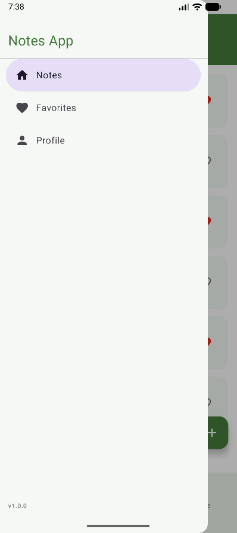
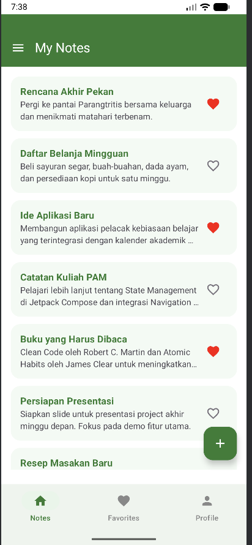
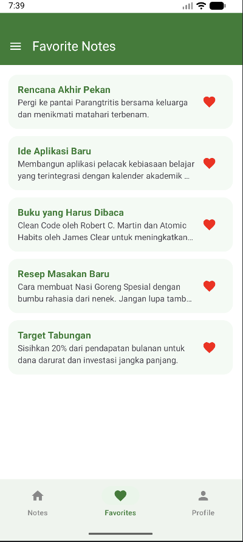
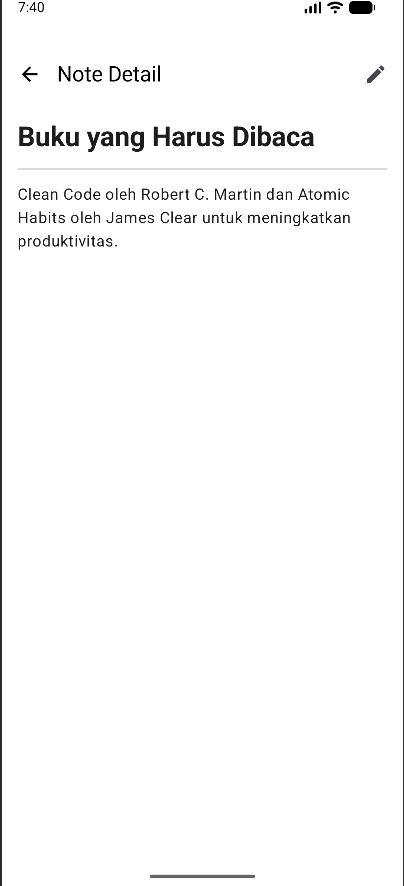
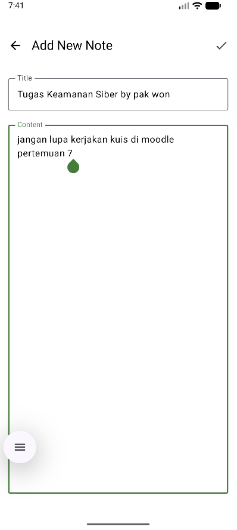
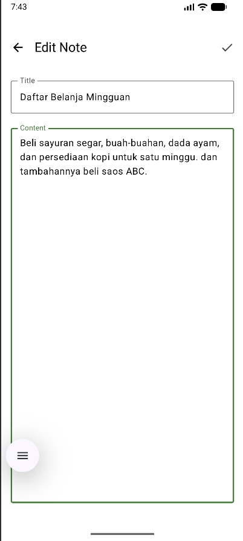
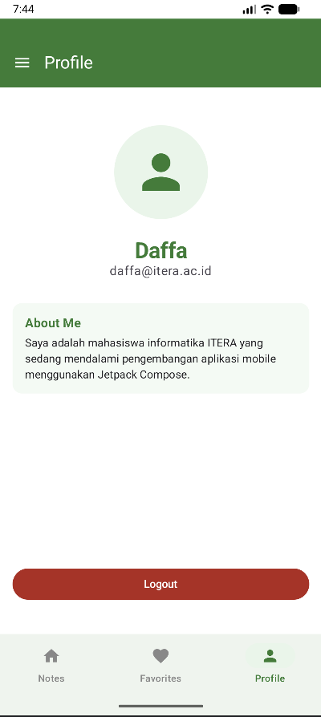

# Tugas 5: Pengembangan Notes App dengan Fitur Navigasi

Aplikasi ini merupakan pengembangan dari aplikasi catatan (Notes App) sebelumnya dengan penambahan sistem navigasi yang kompleks menggunakan **Jetpack Compose Navigation**. Desain aplikasi mengusung tema **Putih & Hijau** yang terinspirasi dari identitas **ITERA**.

## Informasi Mahasiswa
*   **Nama:** M.Daffa Hakim Matondang
*   **NIM:** 123140002
*   **Program Studi:** Teknik Informatika
*   **Instansi:** Institut Teknologi Sumatera (ITERA)

---

## Fitur Utama

Aplikasi ini telah memenuhi seluruh kriteria tugas, yaitu:
1.  **Bottom Navigation**: 3 Tab utama (Notes, Favorites, Profile) dengan state yang sinkron.
2.  **Navigation with Arguments**: Passing `noteId` dari List ke Detail dan dari Detail ke Edit Screen.
3.  **Forward & Back Navigation**: Navigasi antar layar yang proper menggunakan `NavController`.
4.  **Floating Action Button (FAB)**: Navigasi cepat untuk menambah catatan baru.
5.  **Bonus Feature (+10%)**: Implementasi **Navigation Drawer** (Hamburger Menu) yang sinkron dengan Bottom Navigation.

---

##  Struktur Proyek

Sesuai instruksi, kode diatur secara modular untuk kemudahan maintenance:

```text
com.example.tugas5/
├── components/      # Komponen UI reusable (NoteItem, dll)
├── data/            # Repository dan Mock Data
├── model/           # Data Class (Note)
├── navigation/      # Definisi Route dan Sealed Class Navigasi
└── screens/         # Semua layar aplikasi (Notes, Detail, Profile, dll)
```

---

## Dokumentasi Fitur (Screenshots)

### 1. Navigasi Utama (Bottom Bar & Drawer)
| Fitur | Screenshot                    | Keterangan |
|---|-------------------------------|---|
| **Bottom Navigation** |  | Navigasi antar 3 tab utama. |
| **Navigation Drawer** |    | Fitur Bonus: Menu samping untuk navigasi. |

### 2. Manajemen Catatan
| Fitur | Screenshot | Keterangan |
|---|---|---|
| **Notes List** |  | Daftar utama seluruh catatan dengan tema hijau. |
| **Favorites** |  | Daftar catatan yang ditandai sebagai favorit. |
| **Note Detail** |  | Menampilkan isi catatan lengkap berdasarkan `noteId`. |

### 3. Operasi CRUD & Navigasi Argumen
| Fitur | Screenshot                  | Keterangan |
|---|-----------------------------|---|
| **Add Note** |     | Layar tambah catatan baru via FAB. |
| **Edit Note** |  | Navigasi dengan argumen `noteId` untuk mengedit data. |

### 4. Profil Pengguna
| Fitur | Screenshot | Keterangan |
|---|---|---|
| **Profile Screen** |  | Data diri mahasiswa Informatika ITERA. |

---

## ️Navigation Flow Diagram
Berikut adalah alur navigasi aplikasi:
1.  **Notes Screen** (Home) ↔ **Favorites** ↔ **Profile** (via Bottom Bar/Drawer).
2.  **Notes Screen** → **Note Detail** (Klik Item).
3.  **Notes Screen** → **Add Note** (Klik FAB).
4.  **Note Detail** → **Edit Note** (Klik Icon Edit).
5.  **Back Navigation** tersedia di semua sub-layar melalui tombol Back di Top Bar.

---

## Tech Stack
*   **Kotlin Multiplatform (KMP)**
*   **Jetpack Compose** (UI Framework)
*   **Compose Navigation** (Routing)
*   **Material Design 3** (Theme & Components)
*   **Kotlinx Coroutines & Flow** (Data State Management)

---
*Tugas Mata Kuliah Pengembangan Aplikasi Mobile (PAM).*
