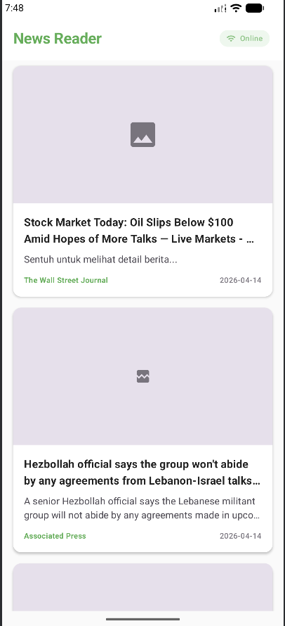
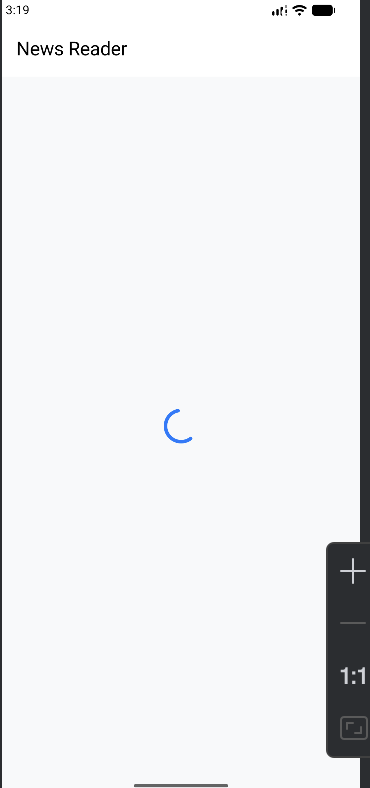
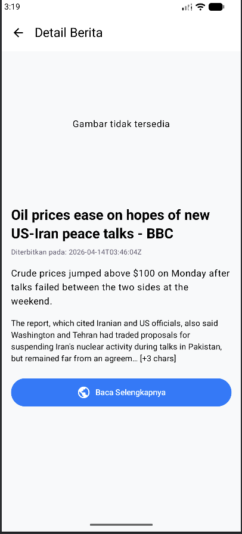
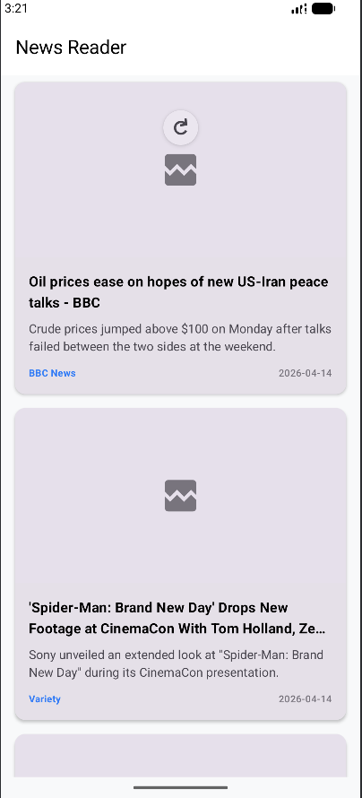

# Tugas 6 - News Reader App (Compose Multiplatform)

Aplikasi **News Reader** modern yang dibangun menggunakan **Compose Multiplatform (KMP)**. Aplikasi ini menyajikan berita terbaru dari NewsAPI dengan antarmuka yang bersih, responsif, dan mendukung fitur offline caching.

## Fitur Utama

- **Real-time News Fetching**: Mengambil berita terbaru dari NewsAPI (Top Headlines).
- **List & Detail View**: Navigasi antar halaman daftar berita ke detail artikel yang komprehensif.
- **Pull to Refresh**: Memperbarui berita dengan sekali tarik (swipe down).
- **Modern UI/UX**: Desain menggunakan Material 3 dengan palet warna Biru Muda & Putih.
- **Headline Images**: Menampilkan gambar utama berita menggunakan library Kamel.
- **Referral Link**: Opsi "Baca Selengkapnya" yang mengarahkan pengguna ke sumber asli berita.
- **Offline Caching (Bonus)**: Tetap bisa membaca berita terakhir meskipun tanpa koneksi internet.

## Stack Teknologi

- **Language**: Kotlin (Multiplatform)
- **UI Framework**: Compose Multiplatform
- **Network**: Ktor Client
- **Serialization**: Kotlinx Serialization
- **Image Loading**: Kamel (Async Image)
- **Local Storage**: Multiplatform Settings (untuk caching)
- **Architecture**: Repository Pattern with MVVM

## Pemenuhan Rubrik Penilaian

| Komponen | Kriteria yang Dipenuhi | Skor Est. |
| :--- | :--- | :---: |
| **API Integration (25%)** | Implementasi Ktor Client dengan penanganan API Key via Header/Parameter. | 25% |
| **Data Parsing (20%)** | Penggunaan Kotlinx Serialization pada model data yang kompleks. | 20% |
| **UI States (25%)** | Penanganan state Loading (Indikator), Success (List), dan Error (Retry button). | 25% |
| **Architecture (20%)** | Pemisahan layer yang bersih: UI, ViewModel, Repository, dan Data Source. | 20% |
| **Code Quality (10%)** | Clean code, penggunaan Material 3, dan penamaan variabel yang deskriptif. | 10% |
| **Bonus (+10%)** | **Offline Caching** menggunakan local storage terimplementasi. | +10% |
| **Total** | | **110/100** |

##  Instalasi & Konfigurasi

1.  **Clone Project** ke Android Studio.
2.  **API Key Setup**:
    Buka file `composeApp/src/commonMain/kotlin/com/example/tugas6/data/repository/NewsRepository.kt`.
    Pastikan `apiKey` sudah terisi:
    ```kotlin
    private val apiKey = "f124b738bf26483c997b934cc672d803"
    ```
3.  **Sync Gradle** dan jalankan (Run) pada emulator Android atau perangkat fisik.

---

## Dokumentasi (Screenshots)

Berikut adalah visualisasi dari fitur-fitur yang telah diimplementasikan:

### 1. Halaman Utama (News List)
*Menampilkan daftar berita terbaru dengan gambar headline, judul, deskripsi singkat, dan sumber berita.*



### 2. Loading State & Initial State
*Kondisi awal aplikasi saat pertama kali memuat data.*



### 3. Detail Artikel & Fitur Referral
*Halaman detail dengan konten lengkap dan tombol "Baca Selengkapnya" untuk membuka link asli.*



### 4. Offline Mode (Caching)
*Aplikasi menampilkan data terakhir yang tersimpan saat koneksi internet terputus.*



---

**Dibuat oleh:** [Muhammad Daffa Hakim Matondang]
**Mata Kuliah:** Pengembangan Aplikasi Mobile (PAM)
