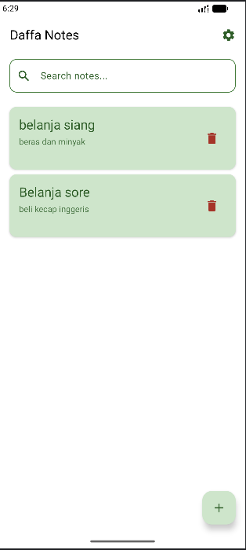
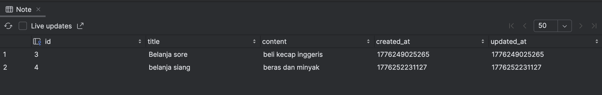

# Daffa Notes - Tugas 7 Pemrograman Aplikasi Mobile (PAM)

**Daffa Notes** adalah aplikasi manajemen catatan (Notes App) berbasis Android yang dikembangkan menggunakan **Kotlin Multiplatform (KMP)** dengan **Compose Multiplatform**. Aplikasi ini dirancang untuk memenuhi kriteria tugas pengembangan aplikasi mobile modern dengan fitur lengkap, performa yang optimal, dan antarmuka pengguna (UI) yang estetik dengan tema warna Hijau (Full Green).

## Link Demo Aplikasi
[Tonton Demo Aplikasi di Sini](https://youtu.be/demo-aplikasi-daffa-notes)

---

## Deskripsi Tugas

Tugas ini bertujuan untuk meng-upgrade aplikasi catatan standar menjadi aplikasi yang memiliki fitur lengkap dan standar industri, meliputi:
1.  **Persistensi Data**: Menggunakan database lokal untuk menyimpan data secara permanen.
2.  **Operasi CRUD**: Implementasi lengkap pembuatan, pembacaan, pembaruan, dan penghapusan data.
3.  **Manajemen State**: Penanganan kondisi UI yang dinamis (Loading, Empty, Success).
4.  **Fitur Pencarian**: Kemampuan mencari data secara spesifik.
5.  **Preferensi Pengguna**: Fitur pengaturan tema dan pengurutan yang tersimpan secara lokal.
6.  **Arsitektur Offline-First**: Memastikan aplikasi dapat digunakan sepenuhnya tanpa koneksi internet.

---

## Tech Stack & Arsitektur

-   **Bahasa Pemrograman**: Kotlin
-   **UI Framework**: Compose Multiplatform (Material 3)
-   **Database**: SQLDelight (SQLite) untuk penyimpanan catatan.
-   **Local Settings**: Multiplatform Settings (KMP version of DataStore) untuk menyimpan preferensi tema dan sortir.
-   **Architecture**: Model-View-ViewModel (MVVM).
-   **Threading**: Kotlin Coroutines & Flow.

---

## Database Schema & Sinkronisasi Data

Aplikasi menggunakan SQLDelight untuk mengelola database SQLite. Berikut adalah struktur tabel dan bukti sinkronisasi data antara aplikasi (Live POV) dengan database inspector.

### Tabel: Note
Definisi tabel di file `Note.sq`:

```sql
CREATE TABLE Note (
    id INTEGER PRIMARY KEY AUTOINCREMENT,
    title TEXT NOT NULL,
    content TEXT NOT NULL,
    created_at INTEGER NOT NULL,
    updated_at INTEGER NOT NULL
);
```

### Sinkronisasi Data (Live App POV vs Database Inspector)
Bagian ini menunjukkan bahwa data yang diinput melalui aplikasi secara *real-time* tersimpan dan tersinkronisasi dengan database SQLite.

**1. Tampilan Live di Aplikasi (App POV):**
Menampilkan daftar catatan yang sedang aktif di aplikasi.


**2. Tampilan di Tabel SQL (Database Inspector):**
Menunjukkan data yang sama persis telah masuk ke dalam tabel database di Android Studio.


---

## Screenshot Per-Halaman (Dokumentasi Aplikasi)

Berikut adalah detail visual dari setiap layar aplikasi **Daffa Notes**:

### 1. Layar Utama (Notes List)
Menampilkan daftar catatan dalam bentuk kartu (Card).
-   **Warna**: Menggunakan tema hijau pudar (Fade Green) untuk kartu agar nyaman di mata.
-   **Identitas**: Judul aplikasi di TopAppBar berubah menjadi **Daffa Notes**.


### 2. Layar Kosong (Empty State)
State yang muncul saat database belum memiliki data.


### 3. Layar Tambah/Edit (Add/Edit Screen)
Formulir input untuk judul dan isi catatan.


### 4. Fitur Pencarian (Search Functionality)
Hasil filter catatan secara real-time berdasarkan kata kunci.


### 5. Layar Pengaturan (Settings Screen)
Halaman untuk kustomisasi tema dan urutan sortir.


### 6. Dialog Konfirmasi Hapus (UX Safety)
Fitur keamanan dialog konfirmasi saat ingin menghapus data.


---

## Ketentuan Penilaian & Implementasi

| Kriteria | Bobot | Status | Detail Implementasi |
| :--- | :---: | :---: | :--- |
| SQLDelight Setup | 20% | Berhasil | Schema tabel Note lengkap dengan query CRUD + Search yang efisien. |
| CRUD Operations | 25% | Berhasil | Mendukung Create, Read, Update, dan Delete (dengan dialog konfirmasi). |
| DataStore/Settings | 15% | Berhasil | Menyimpan preferensi Theme dan Sort Order menggunakan Multiplatform Settings. |
| Search Feature | 15% | Berhasil | Pencarian teks pada judul dan konten catatan secara langsung. |
| UI/UX & States | 15% | Berhasil | Desain Full Green, Material 3, penanganan Loading, Empty, dan Success states. |
| Code Quality | 10% | Berhasil | Kode bersih (Clean Code), tanpa komentar AI, dan mengikuti struktur MVVM. |

---

**Disusun oleh:** Muhammad Daffa Hakim Matondang 123140002
**Mata Kuliah:** Pengembangan Aplikasi Mobile
**Tugas:** Tugas 7 - Upgrade Notes App (SQLDelight, Settings, CRUD)
