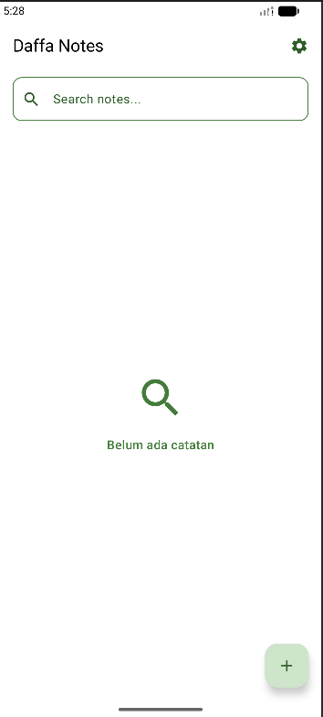
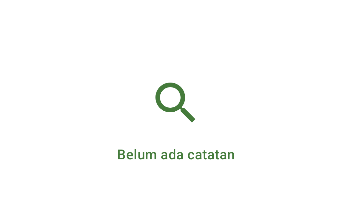
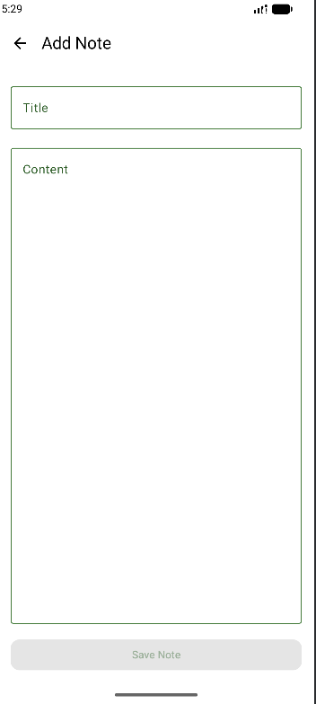
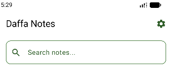
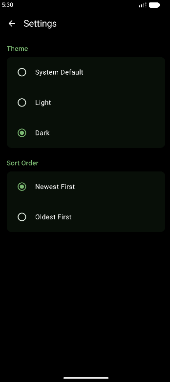
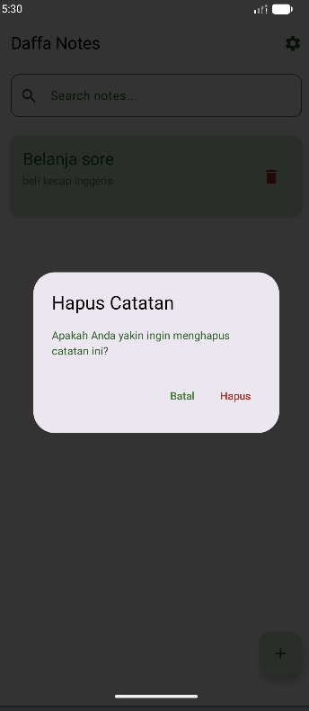

# Daffa Notes - Tugas 7 Pemrograman Aplikasi Mobile (PAM)

**Daffa Notes** adalah aplikasi manajemen catatan (Notes App) berbasis Android yang dikembangkan menggunakan **Kotlin Multiplatform (KMP)** dengan **Compose Multiplatform**. Aplikasi ini dirancang untuk memenuhi kriteria tugas pengembangan aplikasi mobile modern dengan fitur lengkap, performa yang optimal, dan antarmuka pengguna (UI) yang estetik dengan tema warna Hijau (Full Green).

---

## Deskripsi Tugas

Tugas ini bertujuan untuk meng-upgrade aplikasi catatan standar menjadi aplikasi yang memiliki fitur lengkap dan standar industri, meliputi:
1.  **Persistensi Data**: Menggunakan database lokal untuk menyimpan data secara permanen.
2.  **Operasi CRUD**: Implementasi lengkap pembuatan, pembacaan, pembaruan, dan penghapusan data.
3.  **Manajemen State**: Penanganan kondisi UI yang dinamis (Loading, Empty, Success).
4.  **Fitur Pencarian**: Kemampuan mencari data secara spesifik.
5.  **Preferensi Pengguna**: Fitur pengaturan tema dan pengurutan yang tersimpan secara lokal.
6.  **Arsitektur Offline-First**: Memastikan aplikasi dapat digunakan sepenuhnya tanpa koneksi internet.

---

## Tech Stack & Arsitektur

-   **Bahasa Pemrograman**: Kotlin
-   **UI Framework**: Compose Multiplatform (Material 3)
-   **Database**: SQLDelight (SQLite) untuk penyimpanan catatan.
-   **Local Settings**: Multiplatform Settings (KMP version of DataStore) untuk menyimpan preferensi tema dan sortir.
-   **Architecture**: Model-View-ViewModel (MVVM).
-   **Threading**: Kotlin Coroutines & Flow.

---

## Database Schema (SQLDelight)

Aplikasi menggunakan SQLDelight untuk mengelola database SQLite. Skema ini mendukung pencatatan waktu pembuatan dan pembaruan secara otomatis.

### Tabel: Note
Definisi tabel di file `Note.sq`:

```sql
CREATE TABLE Note (
    id INTEGER PRIMARY KEY AUTOINCREMENT,
    title TEXT NOT NULL,
    content TEXT NOT NULL,
    created_at INTEGER NOT NULL,
    updated_at INTEGER NOT NULL
);
```

### Daftar Query:
*   `selectAll`: Mengambil semua catatan, diurutkan berdasarkan waktu pembaruan terbaru.
*   `selectById`: Mengambil detail satu catatan berdasarkan ID unik.
*   `insert`: Menambahkan catatan baru ke database.
*   `update`: Memperbarui judul, isi, dan waktu pembaruan catatan yang sudah ada.
*   `delete`: Menghapus catatan secara permanen berdasarkan ID.
*   `search`: Mencari catatan di mana keyword ditemukan pada kolom `title` atau `content`.

---

## Screenshot Per-Halaman

Berikut adalah detail visual dari setiap layar aplikasi **Daffa Notes**:

### 1. Layar Utama (Notes List)
Menampilkan daftar catatan dalam bentuk kartu (Card).
-   **Warna**: Menggunakan tema hijau pudar (Fade Green) untuk kartu agar nyaman di mata.
-   **Identitas**: Judul aplikasi di TopAppBar berubah menjadi **Daffa Notes**.
-   **Fitur**: Terdapat search bar dan tombol Floating Action Button (FAB) untuk tambah catatan.


### 2. Layar Kosong (Empty State)
State yang muncul saat database belum memiliki data.
-   **Visual**: Menampilkan ikon pencarian besar dan teks "Belum ada catatan" dengan warna yang halus.


### 3. Layar Tambah/Edit (Add/Edit Screen)
Formulir input untuk judul dan isi catatan.
-   **Validasi**: Tombol "Save Note" hanya aktif jika judul dan isi tidak kosong.
-   **Navigasi**: Dilengkapi tombol kembali di kiri atas.


### 4. Fitur Pencarian (Search Functionality)
UI saat pengguna mengetik di bar pencarian.
-   **Perilaku**: Daftar catatan akan terfilter secara real-time berdasarkan kata kunci yang dimasukkan.


### 5. Layar Pengaturan (Settings Screen)
Halaman untuk kustomisasi aplikasi.
-   **Theme**: Pilihan mode Light, Dark, atau mengikuti sistem.
-   **Sort Order**: Pilihan urutan "Newest First" atau "Oldest First".


### 6. Dialog Konfirmasi Hapus (UX Safety)
Fitur keamanan agar catatan tidak terhapus secara tidak sengaja.
-   **Pemicu**: Muncul saat ikon tong sampah ditekan.
-   **Opsi**: Pengguna harus mengonfirmasi ulang untuk benar-benar menghapus data.


---

## Ketentuan Penilaian & Implementasi

| Kriteria | Bobot | Status | Detail Implementasi |
| :--- | :---: | :---: | :--- |
| SQLDelight Setup | 20% | Berhasil | Schema tabel Note lengkap dengan query CRUD + Search yang efisien. |
| CRUD Operations | 25% | Berhasil | Mendukung Create, Read, Update, dan Delete (dengan dialog konfirmasi). |
| DataStore/Settings | 15% | Berhasil | Menyimpan preferensi Theme dan Sort Order menggunakan Multiplatform Settings. |
| Search Feature | 15% | Berhasil | Pencarian teks pada judul dan konten catatan secara langsung. |
| UI/UX & States | 15% | Berhasil | Desain Full Green, Material 3, penanganan Loading, Empty, dan Success states. |
| Code Quality | 10% | Berhasil | Kode bersih (Clean Code), tanpa komentar AI, dan mengikuti struktur MVVM. |

---

**Disusun oleh:** Daffa
**Mata Kuliah:** Pemrograman Aplikasi Mobile
**Tugas:** Tugas 7 - Upgrade Notes App (SQLDelight, Settings, CRUD)
