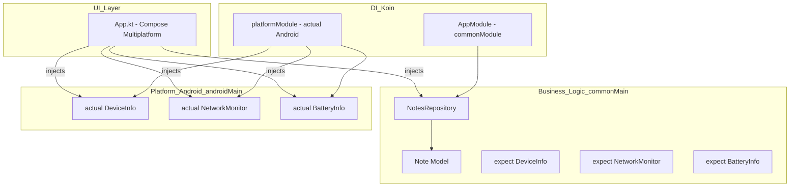
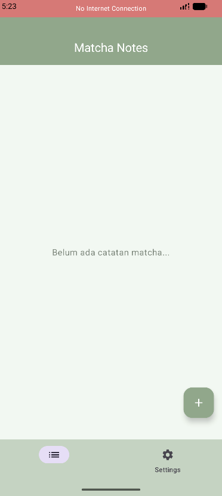
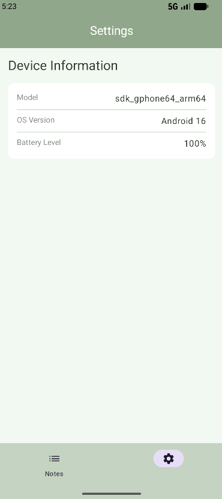
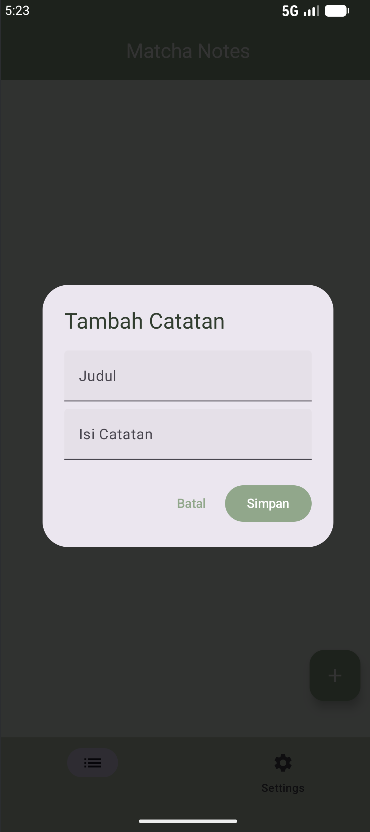

# Tugas 8 PAM - Upgrade NotesApp (KMP & Koin DI)

Proyek ini adalah aplikasi catatan (Notes) sederhana yang dibangun menggunakan **Kotlin Multiplatform (KMP)**. Aplikasi ini mendemonstrasikan implementasi **Dependency Injection (Koin)**, pola **expect/actual** untuk fitur spesifik platform, dan monitoring status perangkat secara real-time.

## Video Demo Aplikasi
Tonton video demo fitur (DI, Device Info, Network Status, & Battery Bonus) melalui link di bawah ini:

---

## Fitur Utama
- **CRUD Notes:** Menambah, melihat, mengedit, dan menghapus catatan .
- **Device Info:** Menampilkan model perangkat dan versi OS menggunakan pola `expect/actual`.
- **Network Monitoring:** Indikator status jaringan real-time yang muncul jika koneksi terputus.
- **Battery Status (Bonus):** Menampilkan persentase baterai perangkat saat ini.
- **Dependency Injection:** Seluruh komponen (Repository, Monitor, Info) dikelola dan di-inject menggunakan Koin.

---

## Arsitektur Aplikasi

Aplikasi ini menggunakan arsitektur berlapis yang memisahkan logika bisnis dengan implementasi platform:

### Diagram Arsitektur

### Penjelasan Komponen:
1.  **Koin DI:** Digunakan untuk mengelola siklus hidup objek. `NotesRepository` didefinisikan sebagai `single` agar data tetap konsisten saat perpindahan layar.
2.  **Expect/Actual:** 
    - `expect` di `commonMain` mendefinisikan *blueprint* fitur.
    - `actual` di `androidMain` mengimplementasikan fitur tersebut menggunakan API Android asli (seperti `ConnectivityManager` dan `BatteryManager`).
3.  **NotesRepository:** Mengelola state catatan menggunakan `mutableStateListOf` agar UI otomatis terupdate saat data berubah.

---

## Screenshots

### 1. Main Screen & Network Indicator
Tampilan utama aplikasi dengan banner indikator saat internet mati.

### 2. Device Info & Battery (Settings)
Halaman settings yang menampilkan informasi perangkat yang disuntikkan melalui DI.

### 3. CRUD Operations
Proses menambah atau mengedit catatan.

---

## Tech Stack
- **Language:** Kotlin
- **Framework:** Compose Multiplatform
- **DI:** Koin
- **Architecture:** Clean Architecture with Expect/Actual pattern
- **Theme:** Material 3 (Matcha Custom Palette)

---

## Cara Menjalankan
1. Clone repository ini.
2. Buka di Android Studio (versi terbaru disarankan).
3. Pastikan sudah menginstal SDK Android 36.
4. Jalankan task `./gradlew :composeApp:assembleDebug` atau klik tombol Run di Android Studio.
