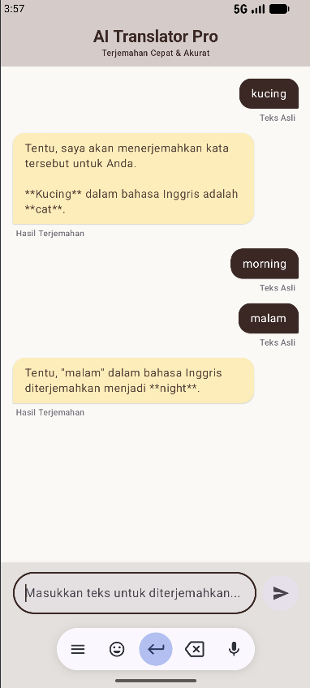
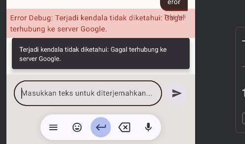

# TUGAS 9 PAM - Integrasi AI API
**Nama:** Muhammad Daffa Hakim Matondang  
**NIM:** 123140002  
**Program Studi:** Teknik Informatika - Institut Teknologi Sumatera  
**Mata Kuliah:** Pengembangan Aplikasi Mobile (PAM)

---

## Deskripsi Proyek
Proyek ini merupakan implementasi dari materi **Pertemuan 9** mengenai **Integrasi AI API** ke dalam aplikasi mobile berbasis Kotlin Multiplatform (KMP). Aplikasi ini bertajuk **AI Translator Pro**, sebuah alat penerjemah cerdas yang memanfaatkan Large Language Models (LLMs) untuk menghasilkan terjemahan yang kontekstual dan akurat.

---

## Learning Objectives (Capaian Pembelajaran)
Berdasarkan modul praktikum, proyek ini telah memenuhi target berikut:
* Memahami cara kerja Large Language Models (LLMs).
* Mengintegrasikan Google Gemini API ke dalam aplikasi KMP menggunakan Ktor Client.
* Menerapkan teknik Prompt Engineering yang efektif.
* Membangun fitur AI-powered dalam aplikasi mobile.

---

## Implementasi & Rubrik Penilaian

### 1. AI Integration (30%)
* **Service Layer**: Menggunakan GeminiService dengan engine Ktor Client untuk melakukan POST request ke endpoint Google Generative Language.
* **Model Engine**: Menggunakan model Gemini 2.5 Flash Lite yang diakses melalui jalur API v1beta untuk performa tinggi.
* **Data DTO**: Implementasi data class @Serializable untuk menangani request dan response JSON secara otomatis.

### 2. Prompt Engineering (25%)
* **System Prompt**: Mendefinisikan perilaku AI sebagai "Penerjemah Profesional" agar hasil tetap akurat.
* **Specific Instruction**: Memberikan batasan agar AI hanya menghasilkan teks terjemahan tanpa narasi tambahan.
* **Format Setting**: Menentukan format output yang jelas untuk memudahkan parsing data.

### 3. Error Handling (20%)
* **HTTP Guard**: Mampu menangani status code seperti 404 (Not Found), 403 (Forbidden), dan 429 (Rate Limited).
* **Resilient Logic**: Menggunakan runCatching dan pengecekan array candidates untuk mencegah crash jika respon kosong.
* **User Feedback**: Aplikasi menampilkan pesan error yang informatif langsung di UI jika terjadi masalah API atau jaringan.

### 4. UI/UX (15%)
* **Typing Indicator**: Menampilkan animasi loading saat AI sedang memproses terjemahan.
* **Chat Interface**: Menggunakan komponen ChatBubble untuk membedakan pesan pengguna dan respon AI.
* **Responsive State**: UI yang responsif dengan feedback visual yang jelas saat terjadi error.

### 5. Code Quality (10%)
* **Security**: API Key disimpan di local.properties dan diakses via BuildConfig agar aman.
* **Architecture**: Menerapkan pemisahan logika bisnis (Repository) dan UI (ViewModel) yang rapi.

---

## Dokumentasi Tampilan Aplikasi

### 1. Integrasi Chat Berhasil
Menampilkan UI saat AI berhasil memberikan respon terjemahan secara akurat.
> 

### 2. Error Handling di Aplikasi
Menampilkan UI saat aplikasi berhasil menangkap dan menampilkan pesan error secara halus kepada pengguna.
> 

---

## Catatan Pengembangan & Troubleshooting
Beberapa kendala teknis yang diselesaikan dalam pengerjaan Tugas 9 ini meliputi:
1. **Endpoint Alignment**: Menyesuaikan URL API ke jalur v1beta agar sesuai dengan model Gemini 2.5 Flash Lite.
2. **Access Fix**: Mengatasi error 403 (Permission Denied) dengan regenerasi API Key dan aktivasi layanan di Google Cloud Console.
3. **Invalidate Cache**: Mengatasi masalah variabel BuildConfig yang tidak terupdate dengan melakukan Invalidate Caches & Restart pada Android Studio.

---

## Cara Menjalankan
1. Tambahkan API_KEY=YOUR_KEY pada file local.properties.
2. Lakukan Build > Clean Project.
3. Jalankan aplikasi melalui emulator Android atau simulator iOS.

---
**© 2026 Muhammad Daffa Hakim Matondang - Tugas 9 PAM ITERA**